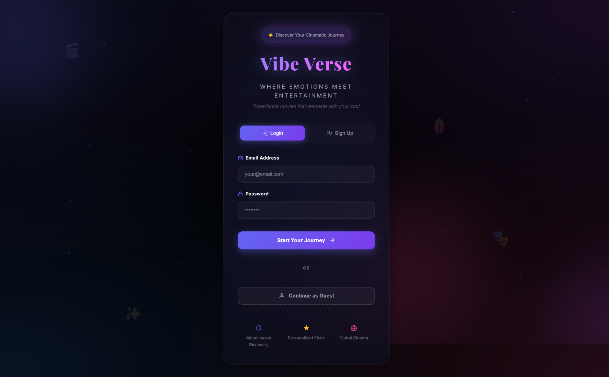
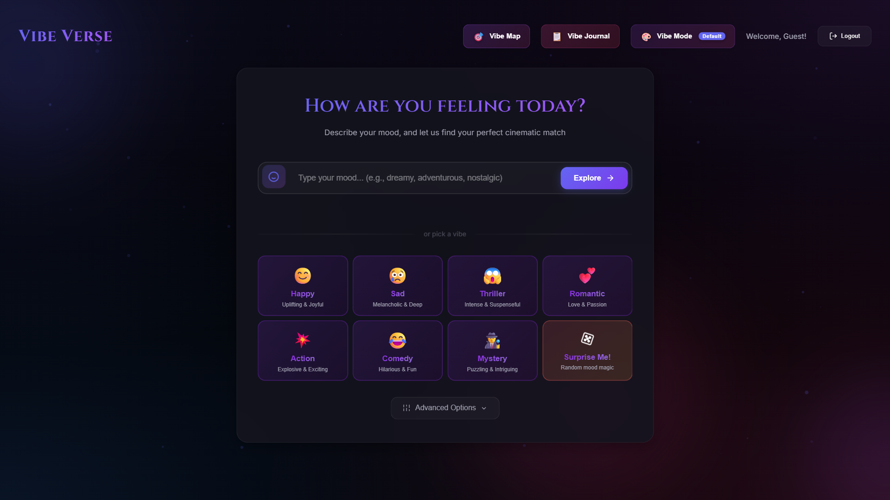
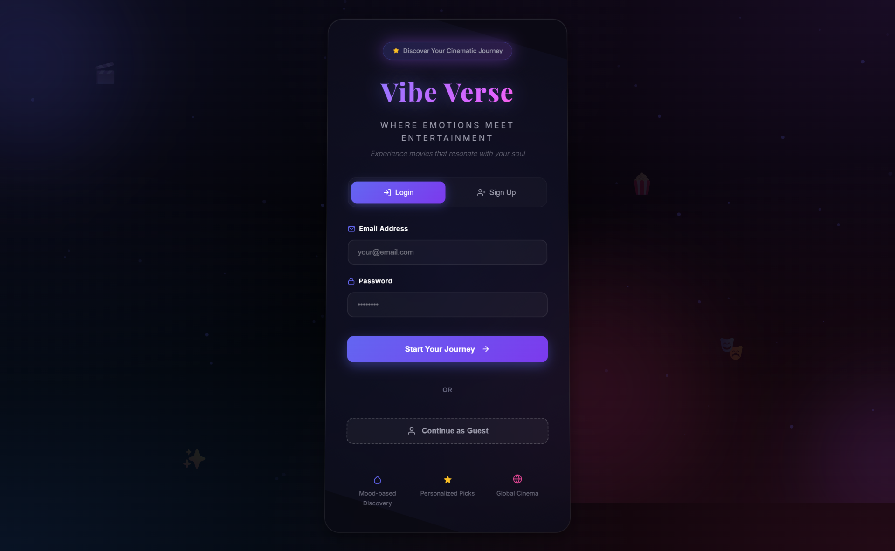
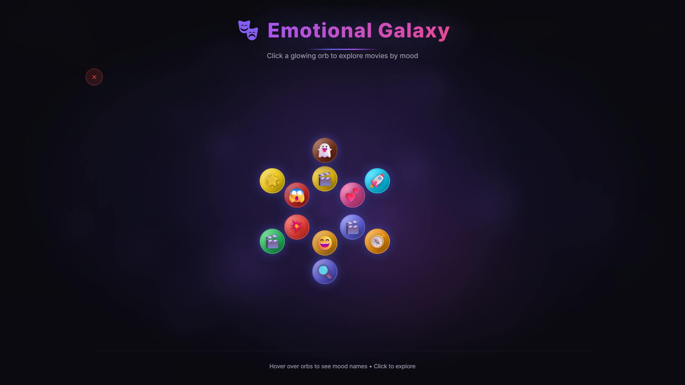
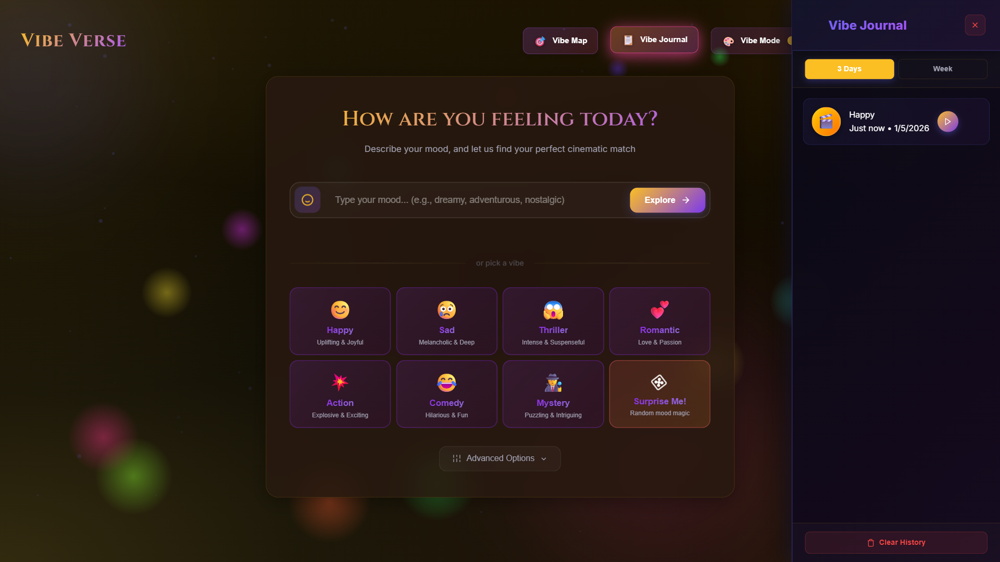

<div align="center">

# 🎬 VibeVerse

### *Your Mood. Your Movie. Your Music.*

[](https://nodejs.org/)
[](https://reactjs.org/)
[](https://expressjs.com/)
[](https://vitejs.dev/)
[](LICENSE)
[]()

**Discover movies and music that perfectly match your emotional state. Experience personalized entertainment recommendations powered by AI-driven mood analysis.**

[Features](#-features--architecture) • [Installation](#-installation) • [Tech Stack](#-tech-stack) • [Documentation](#-documentation)

---

</div>

## 📸 Screenshots

<div align="center">

### Hero Section & Splash Screen

*Beautiful animated splash screen with gradient orbs and smooth transitions*

### Mood Selection Interface

*Interactive mood picker with quick access buttons and advanced quiz options*

### Movie Recommendations

*Curated movie grid with filters, ratings, and streaming availability*

### Music Player

*Integrated YouTube music player with playlist management*

### Vibe Map (Emotional Galaxy)

*Interactive 3D emotional galaxy for exploring moods visually*

### Vibe Journal

*Track your mood history and movie preferences over time*

</div>

---

## 🎯 Overview

**VibeVerse** is an intelligent, mood-based entertainment recommendation platform that combines the power of **TMDb** (The Movie Database) and **YouTube Music APIs** to deliver personalized movie and music suggestions based on your current emotional state.

### What Makes VibeVerse Special?

- 🎭 **Emotion-Driven Discovery**: Describe your mood in natural language or pick from quick mood buttons
- 🎬 **Smart Movie Matching**: Advanced algorithms match your mood to perfect cinematic experiences
- 🎵 **Integrated Music Player**: Seamless YouTube music integration with playlist management
- 🌌 **Interactive Vibe Map**: Explore emotions visually in a beautiful 3D galaxy interface
- 📋 **Mood Journal**: Track your emotional journey and discover patterns
- 🎨 **Dynamic Themes**: Multiple vibe modes that adapt the UI to your mood
- 🌍 **Global Cinema**: Support for multiple languages and international films
- ⚡ **Lightning Fast**: Optimized caching with Redis support for instant results

---

## 🛠️ Tech Stack

### Frontend
| Technology | Version | Purpose |
|------------|---------|---------|
| **React** | 18+ | Component-based UI framework |
| **Vite** | 6.3+ | Lightning-fast build tool and dev server |
| **Redux Toolkit** | Latest | State management for complex app logic |
| **Vanilla JavaScript** | ES6+ | Core functionality and DOM manipulation |
| **CSS3** | Modern | Advanced animations and responsive design |

### Backend
| Technology | Version | Purpose |
|------------|---------|---------|
| **Node.js** | 18+ | Runtime environment |
| **Express.js** | 4.18+ | RESTful API server |
| **Node-Cache** | 5.1+ | In-memory caching layer |
| **ioredis** | 5.3+ | Redis client for distributed caching |
| **Express Rate Limit** | 6.7+ | API rate limiting and protection |

### APIs & Services
- **TMDb API** - Movie and TV show data, trailers, streaming providers
- **YouTube Data API v3** - Music search, video statistics, playlist management
- **iTunes Search API** - Music metadata and previews
- **Deezer API** - Alternative music source with fallback support

### DevOps & Infrastructure
- **Docker** - Containerization for easy deployment
- **Docker Compose** - Multi-container orchestration (Redis + Proxy)
- **Redis** - Distributed caching for production scalability

---

## 📁 Folder Structure

```
VibeVerse/
│
├── 📂 server/                    # Backend Express proxy server
│   ├── 📄 index.js              # Main server file with API routes
│   ├── 📄 Dockerfile           # Docker configuration for server
│   ├── 📄 package.json         # Server dependencies
│   └── 📄 test-health.js       # Health check utility
│
├── 📂 src/                      # React frontend source
│   ├── 📂 app/
│   │   └── 📄 store.js         # Redux store configuration
│   ├── 📂 features/
│   │   └── 📄 feedbackSlice.js # Redux slice for feedback state
│   ├── 📄 App.jsx              # Main React component
│   ├── 📄 main.jsx             # React entry point
│   └── 📄 index.css            # Global styles
│
├── 📂 docs/                     # Documentation and assets
│   └── 📂 images/              # Screenshots and app images
│       ├── hero-section.png
│       ├── mood-selection.png
│       ├── movie-recommendations.png
│       ├── music-player.png
│       ├── vibe-map.png
│       └── vibe-journal.png
│
├── 📄 index.html                # Main HTML entry point
├── 📄 script.js                 # Core application logic
├── 📄 config.js                 # Configuration and API endpoints
├── 📄 style.css                 # Main stylesheet
├── 📄 splash.css                # Splash screen styles
├── 📄 new-screens.css           # Additional screen styles
│
├── 📄 package.json              # Frontend dependencies
├── 📄 vite.config.js            # Vite configuration
├── 📄 docker-compose.yml        # Docker Compose setup
├── 📄 template_config.json      # Template configuration
│
└── 📄 README.md                 # This file
```

---

## 🚀 Installation

### Prerequisites

- **Node.js** 18+ and **npm** or **pnpm**
- **Docker** and **Docker Compose** (optional, for containerized deployment)
- **API Keys**:
  - [TMDb API Key](https://www.themoviedb.org/settings/api)
  - [YouTube Data API v3 Key](https://console.cloud.google.com/apis/credentials)

### Step 1: Clone the Repository

```bash
git clone https://github.com/yourusername/VibeVerse.git
cd VibeVerse
```

### Step 2: Install Dependencies

#### Frontend
```bash
# Using pnpm (recommended)
pnpm install

# Or using npm
npm install
```

#### Backend
```bash
cd server
npm install
cd ..
```

### Step 3: Configure Environment Variables

Create a `.env` file in the `server/` directory:

```env
# Server Configuration
PORT=5174

# API Keys (DO NOT COMMIT THESE!)
TMDB_API_KEY=your_tmdb_api_key_here
YOUTUBE_API_KEY=your_youtube_api_key_here

# Redis Configuration (Optional - for production)
REDIS_HOST=localhost
REDIS_PORT=6379
# OR use Redis URL
# REDIS_URL=redis://localhost:6379
```

### Step 4: Start the Development Servers

#### Terminal 1: Start the Proxy Server
```bash
cd server
npm run dev
```

The server will start on `http://localhost:5174`

#### Terminal 2: Start the Frontend Dev Server
```bash
# From the root directory
pnpm run dev
# or
npm run dev
```

The frontend will start on `http://localhost:5173`

### Step 5: Open in Browser

Navigate to `http://localhost:5173` and start exploring!

---

## 🐳 Docker Deployment

### Quick Start with Docker Compose

1. **Create `.env` file** in the root directory:
```env
TMDB_API_KEY=your_tmdb_api_key_here
YOUTUBE_API_KEY=your_youtube_api_key_here
```

2. **Start all services**:
```bash
docker-compose up --build
```

This will start:
- **Redis** container on port `6379`
- **VibeVerse Proxy** container on port `5174`

### Docker Commands

```bash
# Build and run proxy only
cd server
docker build -t vibeverse-proxy .
docker run -e TMDB_API_KEY="<key>" -e YOUTUBE_API_KEY="<key>" -p 5174:5174 vibeverse-proxy

# Stop all services
docker-compose down

# View logs
docker-compose logs -f
```

---

## ✨ Features & Architecture

### 🎭 Core Features

#### 1. **Mood-Based Discovery**
- Natural language mood input ("feeling nostalgic", "want something uplifting")
- Quick mood buttons (Happy, Sad, Thriller, Romantic, Action, Comedy, Mystery)
- Advanced 3-question quiz for personalized recommendations
- Random mood generator for serendipitous discoveries

#### 2. **Intelligent Movie Matching**
- Multi-page aggregation from TMDb for comprehensive results
- Smart filtering by:
  - Genre and mood alignment
  - Rating thresholds
  - Release year ranges
  - Language preferences
- Auto-relax filters when results are too narrow
- Streaming provider integration (Netflix, Disney+, etc.)

#### 3. **Music Recommendations**
- Mood-synchronized music suggestions
- Multi-source search (YouTube → iTunes → Deezer fallback)
- Official audio prioritization (VEVO, Topic channels)
- View count ranking for relevance
- Integrated YouTube player with:
  - Playlist management
  - Background playback
  - Volume control
  - Progress tracking

#### 4. **Interactive Vibe Map**
- 3D emotional galaxy visualization
- Clickable mood orbs for exploration
- Smooth animations and transitions
- Visual mood representation

#### 5. **Vibe Journal**
- Track mood history (3 days / 1 week views)
- Movie preference logging
- Pattern recognition
- Clear history functionality

#### 6. **Dynamic Vibe Modes**
- 8+ theme variations:
  - Default, Happy, Sad, Energetic
  - Romantic, Calm, Mystery, Horror
- Real-time background adaptation
- Canvas-based visual effects

### 🏗️ Architecture

```
┌─────────────────────────────────────────────────────────────┐
│                        Frontend Layer                        │
│  ┌──────────────┐  ┌──────────────┐  ┌──────────────┐    │
│  │   React UI   │  │  Vanilla JS   │  │  Redux Store  │    │
│  │  Components  │  │   Core Logic  │  │   State Mgmt │    │
│  └──────────────┘  └──────────────┘  └──────────────┘    │
└─────────────────────────────────────────────────────────────┘
                            │
                            │ HTTP Requests
                            ▼
┌─────────────────────────────────────────────────────────────┐
│                    Express Proxy Server                      │
│  ┌──────────────┐  ┌──────────────┐  ┌──────────────┐      │
│  │ Rate Limiter │  │   Caching    │  │  API Router  │      │
│  │  (80 req/min)│  │ (Redis/Mem)  │  │   Endpoints  │      │
│  └──────────────┘  └──────────────┘  └──────────────┘      │
└─────────────────────────────────────────────────────────────┘
                            │
        ┌───────────────────┼───────────────────┐
        │                   │                   │
        ▼                   ▼                   ▼
┌──────────────┐  ┌──────────────┐  ┌──────────────┐
│   TMDb API   │  │ YouTube API  │  │ iTunes API   │
│   (Movies)   │  │   (Music)     │  │  (Fallback)   │
└──────────────┘  └──────────────┘  └──────────────┘
```

### 🔄 Data Flow

1. **User Input** → Mood description or quick selection
2. **Mood Analysis** → Client-side interpretation and API parameter mapping
3. **Proxy Request** → Secure API call through Express server
4. **Caching Check** → Redis (production) or Node-Cache (development)
5. **API Aggregation** → Multiple TMDb pages, YouTube strategies
6. **Result Processing** → Filtering, ranking, deduplication
7. **Response** → JSON data with movies and music
8. **UI Rendering** → React components with smooth animations

### 🎯 Key Optimizations

- **Canonical Query Caching**: Sorted query parameters ensure cache hits
- **Multi-Strategy Search**: YouTube uses 5+ search strategies for better results
- **Video Statistics Ranking**: Results sorted by view count for relevance
- **Aggregate Pagination**: Server-side multi-page fetching reduces client requests
- **Smart Filter Relaxation**: Auto-broadens filters when results are sparse
- **Redis Integration**: Distributed caching for production scalability

---

## 📚 API Endpoints

### Movie Endpoints

| Endpoint | Method | Description |
|----------|--------|-------------|
| `/api/tmdb/discover` | GET | Discover movies with filters |
| `/api/tmdb/aggregate-discover` | GET | Multi-page movie aggregation |
| `/api/tmdb/movie/:id` | GET | Movie details |
| `/api/tmdb/movie/:id/videos` | GET | Movie trailers |
| `/api/tmdb/movie/:id/watch/providers` | GET | Streaming providers |
| `/api/tmdb/discover-tv` | GET | Discover TV series |
| `/api/tmdb/aggregate-discover-tv` | GET | Multi-page TV aggregation |

### Music Endpoints

| Endpoint | Method | Description |
|----------|--------|-------------|
| `/api/youtube/search` | GET | YouTube music search |
| `/api/youtube/aggregate-search` | GET | Multi-strategy music search |
| `/api/music/search` | GET | Unified music search (YouTube → iTunes → Deezer) |
| `/api/itunes/search` | GET | iTunes music search |
| `/api/deezer/search` | GET | Deezer music search |

### Utility Endpoints

| Endpoint | Method | Description |
|----------|--------|-------------|
| `/api/health` | GET | Server health check |

---

## 🔒 Security

- ✅ **API Key Protection**: Keys stored server-side, never exposed to client
- ✅ **Rate Limiting**: 80 requests per minute per IP
- ✅ **CORS Configuration**: Proper cross-origin resource sharing
- ✅ **Environment Variables**: Sensitive data in `.env` (gitignored)
- ✅ **Input Validation**: Query parameter sanitization
- ✅ **Error Handling**: Graceful API failure handling with fallbacks

---

## 🧪 Testing

### Health Check

Test the proxy server health:

```bash
cd server
npm run test:health
```

### Manual Testing Checklist

- [ ] Mood input accepts natural language
- [ ] Quick mood buttons trigger searches
- [ ] Advanced quiz completes and searches
- [ ] Movie grid displays with filters
- [ ] Music player loads and plays
- [ ] Vibe map orbs are clickable
- [ ] Vibe journal saves and displays history
- [ ] Vibe modes change background themes

---

## 🚢 Deployment

### Recommended Platforms

#### Frontend
- **Vercel** (Recommended) - Zero-config React deployment
- **Netlify** - Easy static site hosting
- **GitHub Pages** - Free hosting for public repos

#### Backend
- **Render** - Simple Node.js deployment
- **Heroku** - Traditional PaaS option
- **DigitalOcean App Platform** - Scalable container hosting
- **Railway** - Modern deployment platform

### Deployment Steps

1. **Set Environment Variables** in your hosting platform:
   - `TMDB_API_KEY`
   - `YOUTUBE_API_KEY`
   - `PORT` (if not using default)

2. **Build Frontend**:
   ```bash
   pnpm run build
   # Output in dist/ directory
   ```

3. **Deploy Backend**:
   - Point to `server/` directory
   - Start command: `node index.js`
   - Set environment variables

4. **Update Frontend Config**:
   - Update API base URL in `config.js` to point to deployed backend

---

## 🤝 Contributing

Contributions are welcome! Please follow these steps:

1. Fork the repository
2. Create a feature branch (`git checkout -b feature/AmazingFeature`)
3. Commit your changes (`git commit -m 'Add some AmazingFeature'`)
4. Push to the branch (`git push origin feature/AmazingFeature`)
5. Open a Pull Request

### Development Guidelines

- Follow existing code style
- Add comments for complex logic
- Update README for new features
- Test thoroughly before submitting PR

---

## 📝 License

This project is licensed under the **MIT License** - see the [LICENSE](LICENSE) file for details.

---

## 🙏 Acknowledgments

- **TMDb** for comprehensive movie database
- **YouTube** for music streaming capabilities
- **iTunes & Deezer** for additional music sources
- **React & Vite** communities for excellent tooling
- **All Contributors** who help improve VibeVerse

---

## 📧 Contact & Support

- **Issues**: [GitHub Issues](https://github.com/yourusername/VibeVerse/issues)
- **Discussions**: [GitHub Discussions](https://github.com/yourusername/VibeVerse/discussions)
- **Email**: your.email@example.com

---

<div align="center">

### Made with ❤️ by the VibeVerse Team

**⭐ Star this repo if you find it helpful!**

[⬆ Back to Top](#-vibeverse)

</div>
